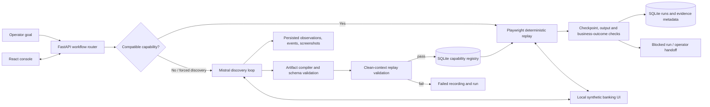
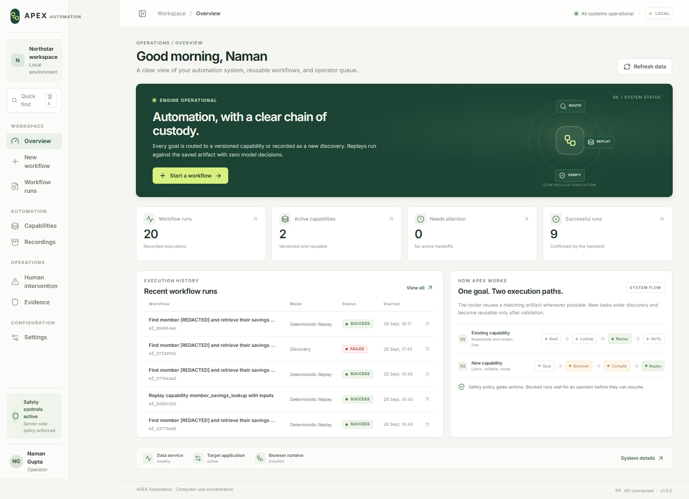
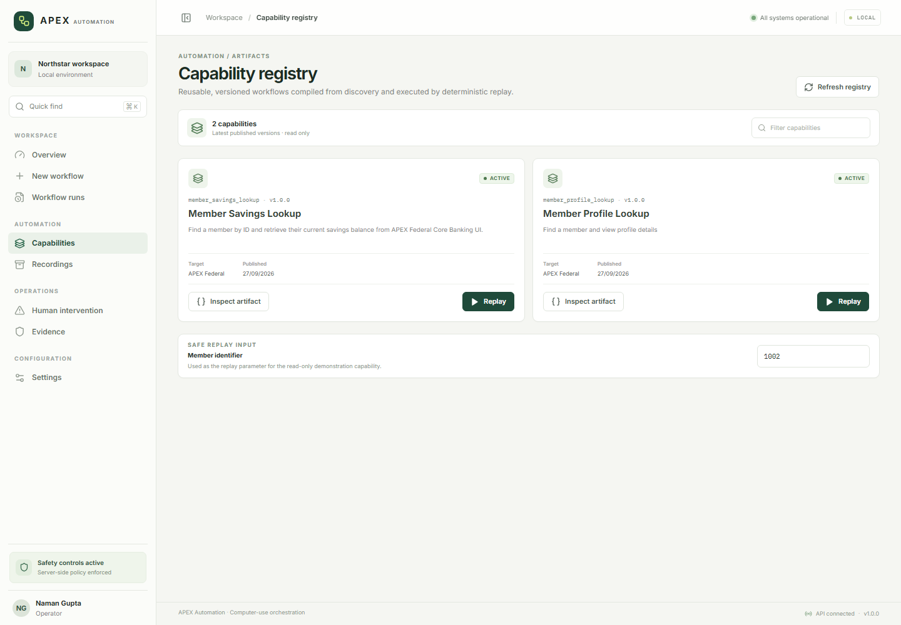
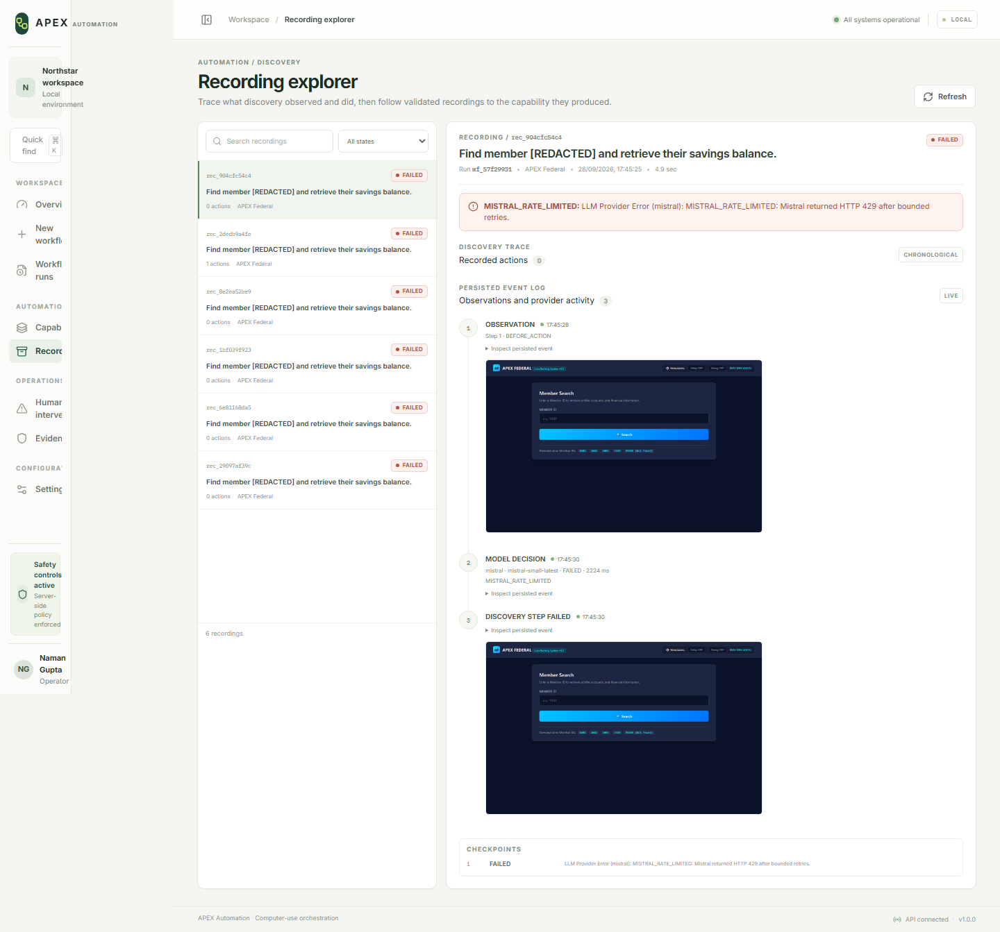
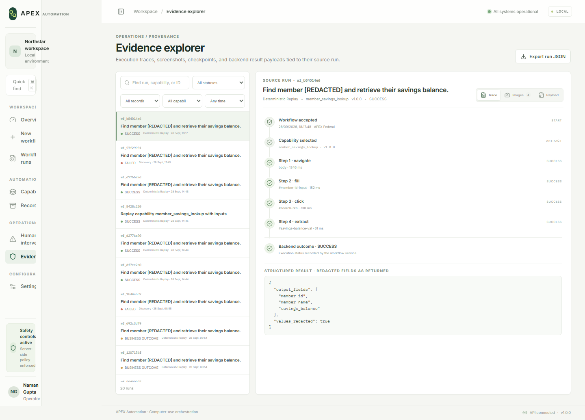
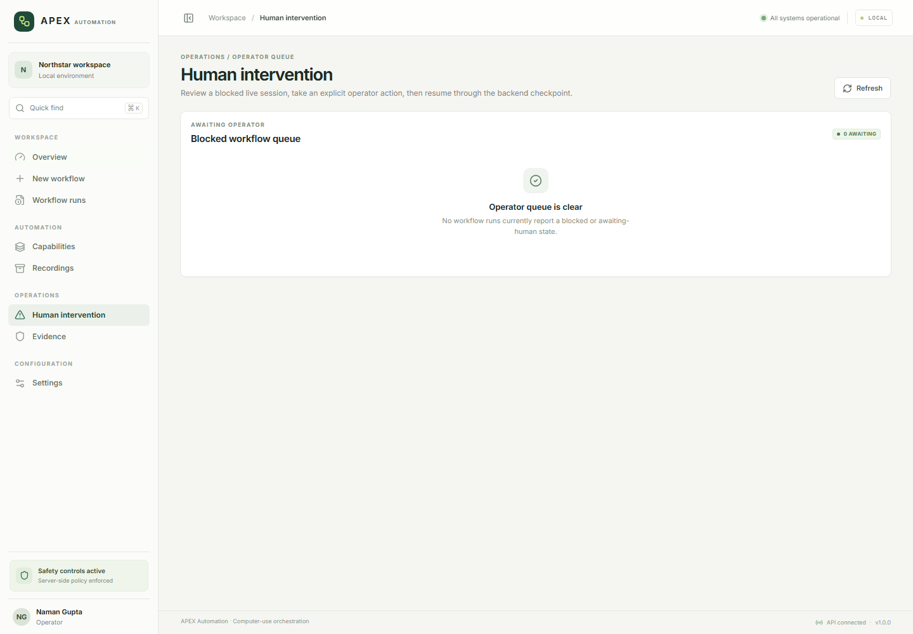

# APEX Automation

**Intelligent Workflow Orchestration Console**  
Discover a browser workflow once, validate it, then replay its saved action sequence without model decisions.

APEX Automation is a local engineering demonstration for computer-use automation against a **synthetic APEX Federal banking application**. It explores how UI-driven work can be made reusable and inspectable when a legacy application has no suitable API. It is not connected to a real credit union and must not be used to operate real accounts.

[Architecture](docs/architecture.md) · [Local setup](docs/development.md) · [API reference](docs/api-reference.md) · [Testing](docs/testing.md) · [Troubleshooting](docs/troubleshooting.md)

## At a glance

An operator submits a goal. The router chooses a matching validated capability when one is available. That replay follows the artifact's prescribed steps and does not call an LLM for decisions. If no capability matches, a discovery run can use Mistral AI to observe the local browser UI and choose actions. A successful discovery is compiled into a typed artifact and must pass a clean-context replay before publication.

This separation reduces repeated model decisions and makes subsequent runs easier to inspect. It does not make browser execution independent of UI drift, data state, timing, or selector validity. The live local registry currently reports two read-only capabilities: savings lookup and profile lookup.



All components above exist in the repository. The checked-in Docker Compose file is not a runnable deployment: its referenced Dockerfiles are absent, and its PostgreSQL URL needs a driver not declared in the project dependencies. See [the implementation inventory](docs/implementation-inventory.md).

## What works today

| Area | Verified implementation | Scope and limits |
|---|---|---|
| Workflow routing | Capability lookup routes supported goals to saved replay; `DISCOVERY` and `REPLAY` can be explicitly selected. | Goal matching is currently keyword-based for savings balance and profile lookup. |
| Discovery | Mistral produces one schema-validated action at a time from a bounded Playwright observation. | Requires a reachable, usable Mistral account; recent live checks received HTTP 429. |
| Recording | Discovery observations, provider decisions, action results and screenshot paths are persisted incrementally. | Screenshots are best effort; failure can leave partial evidence. |
| Artifact compilation | Read-only trace steps are normalized, typed and versioned. Publication requires a successful clean-context replay. | Dynamic parameter extraction currently specializes in `member_id`; this is not a general workflow learner. |
| Replay | Saved artifacts validate inputs, resolve selectors, execute prescribed actions, check checkpoints and extract outputs without LLM decision calls. | Playwright web surface only; UI changes can break selectors. |
| Outcomes | Replay distinguishes `SUCCESS`, `BUSINESS_OUTCOME`, `BLOCKED` and `FAILED`; details include an outcome category and error code where available. | Some low-level replay action failures remain generic strings. |
| Human intervention | A blocked run can preserve a live browser context for operator actions and a verification-based resume. | The session is in process memory and is lost on backend restart. Resume verifies the page; it does not resume an arbitrary remaining action plan. |
| Console | React views cover runs, capabilities, recordings, handoffs, evidence and settings. Active views poll the API. | No frontend test suite or authentication layer is present. |

## Screenshots

These are screenshots captured from the running local app on 2026-09-29. Run history and identifiers are synthetic/local demo data.

### Operations overview



### Capability registry



### Recording explorer



### Evidence explorer



### Human intervention queue



The capture shows the empty queue: no blocked live session was active during the documentation audit. The handoff controls are described in [Human intervention](docs/human-intervention.md).

The `SAFETY_ALLOW_RISKY_ACTIONS` setting is declared, but the current default policy does not consume it; setting it does not change action decisions. See [Safety and security](docs/safety-and-security.md) for the implementation limits.

## Technology

- **Python 3.12+**, FastAPI, Pydantic v2, SQLAlchemy 2 async, and `aiosqlite` for the default local SQLite database.
- **Playwright for Python** and Chromium provide the current web automation surface.
- **Mistral chat completions API**, called through `httpx`, supplies discovery decisions. `MISTRAL_API_KEY` and `MISTRAL_MODEL` configure it. The project also declares the `mistralai` package, though the current client makes direct `httpx` requests.
- **React 18, TypeScript, Vite 5**, Tailwind CSS tooling and `lucide-react` build the console. The Vite dev server proxies `/api` and `/evidence` to FastAPI.
- **pytest** and `pytest-asyncio` cover backend unit tests and one browser-backed integration test. There is no configured frontend test runner or browser E2E suite.

## Repository map

```text
backend/app/
  api/v1/endpoints/  FastAPI routes for workflows, runs, handoffs, safety, health, artifacts and recordings
  artifacts/         Pydantic artifact schema, compiler and DB/JSON storage
  core/              Settings, logging and error/outcome taxonomy
  db/                SQLAlchemy orchestration and synthetic banking models
  discovery/         Mistral action loop, action schema and prompts
  escalation/        In-memory Playwright sessions and operator actions
  llm/               LLM interface, factory and Mistral HTTP client
  orchestration/     Workflow routing, recording persistence and publication lifecycle
  replay/             LLM-free artifact execution and checkpoint evaluation
  safety/             URL/action policy and value redaction
  surfaces/           Computer-surface interface and Playwright adapter
backend/migrations/   One additive SQL migration; not an automatically applied migration system
backend/tests/        pytest unit and browser-backed integration tests
target-app/app.py     Local synthetic banking website, JSON member API and dialog simulator
frontend/src/         React console and its API client
scripts/              Synthetic-data seed, direct discovery/replay and demonstration scripts
docs/                 Architecture, lifecycle, operational guides, ADRs and screenshots
evidence/              Runtime evidence and JSON artifact mirrors used by storage fallback
```

## Prerequisites

- Python **3.12 or newer** (the repository declares `requires-python = ">=3.12"`).
- Node.js and npm. The repository does not pin a Node version; this checkout was validated with Node 22.23.2 and npm 10.9.8.
- Playwright Chromium installed for the selected Python environment.
- A Mistral API key only when running **new discovery**. Listing and replaying existing artifacts do not require a key.

## Quick start (Windows PowerShell)

From the repository root, create an environment and install dependencies:

```powershell
py -3 -m venv .venv
.\.venv\Scripts\Activate.ps1
python -m pip install -e ".[dev]"
python -m playwright install chromium
Copy-Item .env.example .env
```

For new discovery, replace the placeholder `MISTRAL_API_KEY` in `.env` with your key. Do not commit `.env`. The default SQLite database is `orchestration.db` in the current working directory. Start the app with the **same working directory and environment** for the target and backend.

Seed the synthetic bank rows once in a fresh database:

```powershell
python -m scripts.seed_database
```

The default dataset has member IDs 1000–1599. The seeder refuses collisions. To replace only rows tagged as the synthetic demo batch, both explicit flags are required:

```powershell
python -m scripts.seed_database --members 600 --start-id 1000 --reset-demo-data --confirm-demo-reset
```

Install the locked frontend dependencies:

```powershell
Push-Location frontend
npm ci
Pop-Location
```

Run each service in its own PowerShell window:

```powershell
# Terminal 1 — synthetic banking UI
python target-app\app.py
```

```powershell
# Terminal 2 — orchestration API (avoid --reload on Windows)
python -m uvicorn backend.app.main:app --host 127.0.0.1 --port 8000
```

```powershell
# Terminal 3 — console
Push-Location frontend
npm run dev
```

Open [http://127.0.0.1:3000](http://127.0.0.1:3000). The target simulator is at [http://127.0.0.1:3001](http://127.0.0.1:3001), and FastAPI OpenAPI docs are at [http://127.0.0.1:8000/docs](http://127.0.0.1:8000/docs).

Check readiness:

```powershell
Invoke-RestMethod http://127.0.0.1:8000/api/v1/health/ready | ConvertTo-Json -Depth 5
```

Readiness checks the database, target URL and presence of a Chromium installation. It does **not** test browser launch permission or Mistral network access; Mistral is reported as configured/not configured only.

Linux/macOS use the equivalent `python3 -m venv .venv`, `.venv/bin/python -m pip install -e '.[dev]'`, `.venv/bin/python -m playwright install chromium`, `cp .env.example .env`, `npm ci`, and `npm run dev` commands. Start the backend with `.venv/bin/python -m uvicorn backend.app.main:app --host 127.0.0.1 --port 8000` and the target with `.venv/bin/python target-app/app.py`.

Detailed steps and configuration are in [Development](docs/development.md) and [Configuration](docs/configuration.md).

## Run a workflow

### Reuse a capability (no LLM decision calls)

The router selects the savings capability for this goal. `force_mode` makes the path explicit:

```powershell
$body = @{
  goal = "Find member 1002 and retrieve their savings balance."
  target_app = "APEX Federal"
  input_parameters = @{ member_id = "1002" }
  force_mode = "REPLAY"
} | ConvertTo-Json -Depth 5

Invoke-RestMethod -Uri http://127.0.0.1:8000/api/v1/workflows/run `
  -Method Post -ContentType "application/json" -Body $body
```

The synthetic fixture for member `1002` is John Doe with a current savings snapshot of `$7,250.00`. Member `1013` exercises the multiple-active-savings outcome; `99999` exercises member-not-found. These workflows use local synthetic data only.

This workspace contains savings and profile JSON artifact mirrors under `evidence/artifacts/`. The database seeder creates banking rows, not capabilities; if an environment omits those mirrors and has no capability rows, replay requires a successful discovery first.

### Start discovery

Set `force_mode` to `DISCOVERY` to use Mistral even if a matching capability exists. Omit it to let the router choose. A discovery result becomes a published capability only after compilation, schema validation and clean-context replay succeed.

```powershell
$body = @{
  goal = "Find member 1002 and retrieve their savings balance."
  target_app = "APEX Federal"
  input_parameters = @{ member_id = "1002" }
  force_mode = "DISCOVERY"
} | ConvertTo-Json -Depth 5

Invoke-RestMethod -Uri http://127.0.0.1:8000/api/v1/workflows/run `
  -Method Post -ContentType "application/json" `
  -Headers @{ "Idempotency-Key" = "demo-discovery-2026-09-29" } -Body $body
```

The key is optional, 8–255 visible ASCII characters. It is hashed before persistence. Reusing it for the same request returns the associated run; different request content returns HTTP 409. A Mistral key being configured does not guarantee provider availability; rate limits and provider failures are recorded.

## Tests

```powershell
.\.venv\Scripts\python.exe -m pytest backend\tests\ -q
Push-Location frontend
npm run build
Pop-Location
```

The backend has unit tests plus a browser-backed LLM-free replay integration test. On Windows the integration test may need a process policy that allows Playwright's driver child process to create its IPC pipe. See [Testing](docs/testing.md) for the verified result, test coverage and gaps. The frontend build type-checks with `tsc`; no frontend test command is configured.

## API and operations

Routes cover health, workflow submission and explicit replay, run history/details, capabilities, recordings/events, safety policy and handoff. Start at [the API reference](docs/api-reference.md) or the generated [OpenAPI document](http://127.0.0.1:8000/openapi.json). The console polls active run/recording data; it does not use SSE or WebSockets.

## Safety, data and known limits

- All included financial data is synthetic. Current balances are snapshots; generated transaction activity is not a reconciled ledger.
- The service has no API authentication or tenant isolation. CORS is not an authorization control. The `/evidence` directory is statically served without user-level access checks.
- The URL/action safety policy is a local development guardrail based partly on host, route and selector/value keyword checks. It is not a production security boundary and is not a general-purpose browser sandbox.
- Browser support is currently Chromium through Playwright; native desktop control is not implemented.
- Handoff state is held in process memory. A backend restart closes the continuity guarantee and marks persisted waiting sessions as lost.
- Only savings lookup and profile lookup are current reusable capabilities. Transaction, card, loan and statement data exist in the simulator, but corresponding automation capabilities are not delivered.
- Database initialization uses SQLAlchemy `create_all`; there is no migration runner. The single SQL migration is not automatically executed. PostgreSQL/Docker Compose is not currently reproducible from this checkout.
- No license file exists. No reuse license is asserted here.

Read [Safety and security](docs/safety-and-security.md), [Human intervention](docs/human-intervention.md), [Troubleshooting](docs/troubleshooting.md) and [Known implementation status](docs/implementation-inventory.md) before extending the system.

## Development and contribution

Use feature-sized changes, keep secrets in ignored `.env`, add or update tests for behavior changes, and verify both backend tests and frontend build. There is no formal contribution guide or license at the time of this audit. See [Development](docs/development.md) for the local workflow and [ADR 0001](docs/decisions/0001-discovery-and-replay-separation.md), [ADR 0002](docs/decisions/0002-capability-artifact-design.md) and [ADR 0003](docs/decisions/0003-safety-and-human-intervention.md) for documented rationale.
