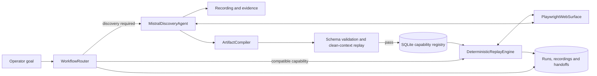

# 1. Architecture

APEX Automation is a local vertical slice for computer-use automation against a synthetic banking UI. `POST /api/v1/workflows/run` accepts a goal and inputs. `WorkflowRouter` keyword-matches savings-balance/profile goals, extracts a four- or five-digit member ID and looks up an active SQLite artifact. Compatible requests use `DeterministicReplayEngine`; otherwise the router can discover or honor `force_mode`. This is not a general language planner.

The invariant is: **LLMs discover workflows; approved, compiled capabilities execute deterministically without an LLM decision loop.** `MistralDiscoveryAgent` observes through `PlaywrightWebSurface`, requests one typed action at a time, and subjects supported decisions to schema and safety checks. Successful traces are compiled, validated and replayed in a fresh context before publication. Later runs execute the artifact without model calls.



The Mistral client uses the chat-completions API, structured JSON output, timeouts, size/output bounds and bounded retries for selected transient errors. Provider failure ends discovery; there is no alternate model or LLM-assisted replay recovery. Router callbacks persist discovery observations, provider decisions, action results and best-effort screenshots, so failures can leave partial recordings. FastAPI, SQLAlchemy and SQLite run in one process. Durable run/action records use tenant-scoped version compare-and-swap claims to prevent duplicate handoff actions or concurrent resumes across workers; browser sessions and the login rate limiter remain process-local.

# 2. Artifact schema

`CapabilityArtifact` (`backend/app/artifacts/schema.py`) is a Pydantic contract: schema/capability versions, target application/surface, optional source recording, typed inputs and outputs, ordered `ReplayStep`s, terminal condition and metadata. Steps declare a finite action, target, optional literal/input binding and checkpoints. Targets carry a primary CSS selector plus selector, text and ARIA fallback fields; replay uses the first three, not `aria_fallback`.

The compiler generalizes a discovered member ID to a `member_id` string input; other fill/select values remain literal. Outputs define name, shape, selector and optional attribute. Typed checkpoint/terminal rules include URL, text, title and element checks. Validation rejects extra fields, duplicate names, unsupported targets, undeclared references and empty/non-contiguous steps. Versions are immutable; `capability_versions` stores the artifact JSON, with a JSON mirror written after commit. Replay receives the validated artifact, not the transcript.

This schema-conformant example uses the current savings capability’s fields and selectors:

```json
{
  "schema_version": "1.0.0",
  "capability_id": "member_savings_lookup",
  "version": "1.0.0",
  "name": "Member Savings Lookup",
  "description": "Retrieve a member's savings balance from APEX Federal.",
  "target_application": "APEX Federal",
  "surface_type": "web",
  "parameters": [{"name": "member_id", "param_type": "string", "description": "Target member ID", "required": true}],
  "outputs": [{"name": "savings_balance", "shape": "currency", "selector": "#savings-balance-val"}],
  "steps": [
    {"step_number": 1, "action_type": "fill", "target": {"primary_selector": "#member-id-input", "fallback_selectors": ["input[name=\"member_id\"]"]}, "value_expression": "${inputs.member_id}", "parameter_ref": "member_id"},
    {"step_number": 2, "action_type": "click", "target": {"primary_selector": "#search-btn", "fallback_selectors": ["button[type=\"submit\"]"], "text_fallback": "Search"}, "checkpoints": [{"rule_type": "url_contains", "target": "/member/"}]}
  ],
  "success_condition": {"rule_type": "element_visible", "target": "#savings-balance-val"}
}
```

The artifact is a capability contract because it declares the supported inputs, outputs, targets, ordered actions and verification conditions needed for execution. It omits transient observations and model reasoning, so replay is inspectable and independent of the original provider response. The versioned typed structure provides extension points, although some schema options currently exceed replay support (for example, standalone `assert` steps).

# 3. Determinism & error handling

Replay revalidates the stored artifact, checks required/unknown inputs and basic constraints, binds inputs and executes steps in order. It resolves the primary, CSS fallback and text selectors; click/fill/extract use Playwright visibility waits (typically five seconds). After a short inter-step delay, step checkpoints currently evaluate URL fragments. The engine then checks the terminal condition, extracts outputs and validates currency/member identity where applicable.

The engine returns `SUCCESS`, `BUSINESS_OUTCOME`, `BLOCKED` or `FAILED`. It recognizes member-not-found, ambiguous-savings-account and savings-account-not-found from page text. Input/artifact errors, unsupported steps, policy denials, failed actions/checkpoints, invalid outputs and terminal-check failures return failure; unexpected confirmation dialogs block for intervention. Startup/provider errors are classified. Only selected transient Mistral HTTP failures retry; failed workflows are not automatically restarted or repaired by an LLM. `test_critical_deterministic_replay_is_llm_free` injects a client that raises if called and asserts a successful member-1002 replay with the expected balance and name.

Run steps and screenshot paths are persisted; screenshots are best effort. The engine writes a redacted replay execution JSON on its normal completion path, so early returns may lack that file. These guarantees cover action order and decision-source separation, not identical outcomes: selector drift, timing, browser behavior and external application state still affect execution. Business-outcome detection depends in part on page text, and the supported checks do not make arbitrary application changes safe or recoverable.

# 4. Heterogeneity & multi-tenant

`PlaywrightWebSurface` is the only implemented adapter for `ComputerSurface` (`connect`, `observe`, `locate`, actions, extraction, screenshots and URL). Accessibility-tree-first or desktop automation would need new adapters and matching semantics. The artifact validator restricts execution to `APEX Federal`; routing covers only local savings/profile lookup patterns. Tenant and operator identities, role-based access, audit events, and tenant filters for runs, recordings, handoffs and evidence are implemented. Published capability definitions remain shared and read-only; tenant-specific policies and artifact registries are not implemented.

CSS/text fallbacks tolerate limited DOM changes, not materially different UIs. Tenant-scoped artifact selection, per-tenant routes/policies and vendor-version overrides remain possible extensions. The current tenant model isolates operational records and access, but does not provide cross-institution workflow portability or tenant-specific capability definitions.

# 5. Escalation & handoff

Discovery stops on an unexpected confirmation dialog or explicit `escalate`; replay returns `BLOCKED` when it detects the simulator’s dialog. The router stores run/step/reason and evidence, retaining the live surface. `GET /api/v1/runs/{run_id}/handoff` reports state and session availability. `POST /api/v1/runs/{run_id}/handoff/action` accepts bounded click/type/key/screenshot actions only for an active handoff, validates parameters and applies policy, with a special path for `#confirm-dialog-btn`. Operator actions are added to handoff history with supported redaction.

Deterministic replay persists a redacted checkpoint with an artifact fingerprint, stable action IDs, completed/pending state, retry classification, required input names and sanitized route class; submitted input values and browser state are excluded. A live-session resume verifies the artifact and route, then continues after the operator-resolved checkpoint. If the browser process was lost, recovery can rebuild the surface from the configured target root and restart only actions classified safe after state reconstruction, after verifying artifact fingerprint and inputs. A changed artifact, unsafe retry class or input mismatch denies automatic reconstruction. Optimistic version checks prevent competing workers from claiming an action or resume. Recovery is deterministic and LLM-free, but does not restore cookies or page memory. Discovery interruptions have no published deterministic artifact, so their active browser session cannot be recovered after process loss.

Handoff sessions persist states such as `AWAITING_OPERATOR`, `ACTION_IN_PROGRESS`, `RESUMING`, `RECOVERY_REQUIRED`, `EXPIRED`, `COMPLETED` and `FAILED`; expiry is checked on action/resume endpoints. Startup marks live-process sessions `RECOVERY_REQUIRED` rather than claiming the browser remains available. JWT authentication and Admin/Operator/Viewer authorization protect the endpoints, while tenant filters hide cross-tenant objects as not found.

# 6. Safety

`SafetyPolicy` checks HTTP(S) URLs against configured domains, permitted ports and narrow routes, then applies exact simulator action/selector allowlists. Discovery checks each model action; replay checks each step; handoff checks operator requests. Unsupported actions and denials stop execution. Model output is untrusted input, not authorization: policy code decides whether an action is allowed.

The policy is fail-closed and specific to the local simulator. URL validation requires HTTP(S), a configured hostname, a permitted port, no credentials/query/fragment, and either `/` or a narrowly matched member route. Actions are allowlisted by exact simulator selector/action semantics; unknown or critical actions are denied. The exact active simulator confirmation can proceed only through an approval decision bound to its run, handoff and action ID. The legacy `SAFETY_ALLOW_RISKY_ACTIONS` setting cannot override these rules. These checks reduce accidental or model-directed actions but are not a general browser sandbox; hostname allowlists alone do not provide DNS-rebinding protection. Discovery prompts label page content untrusted but do not eliminate prompt injection. Redaction is pattern/key based and incomplete; screenshots may contain page data, and bounded DOM observations are sent to Mistral during discovery.

HS256 JWT authentication validates signature, issuer, audience, time claims and active operator status. Passwords use salted PBKDF2-SHA256 hashes. Self-service registration does not require an invitation: the server assigns each new account the active `default` tenant and standard `OPERATOR` role; clients cannot choose a tenant or role. Usernames/emails are normalized and protected by database uniqueness constraints/indexes. Tenant-scoped routes and evidence enforce record ownership, and audit events capture authentication, administration, safety and handoff decisions. Login/registration throttling is per process; audit rows are append-only by application convention and can be modified by a database administrator. CORS is not authorization. The app makes no production security or financial-regulatory compliance guarantee.

The sign-in failure in the local checkout was caused by incomplete initialization, not a frontend/backend endpoint mismatch: the API startup log reported that `APEX_JWT_SIGNING_KEY` was missing or too short, and the configured SQLite database had zero operator rows. Therefore no first administrator had been provisioned to authenticate. Startup bootstrap remains one-time and idempotent from environment-supplied username and PBKDF2 hash; existing operator rows or the durable bootstrap marker prevent later bootstrap settings from recreating or overwriting accounts. This checkout is configured for SQLite and does not declare a PostgreSQL async driver, so PostgreSQL startup/migrations could not be verified.

# 7. Cuts

The delivered slice covers goal routing, Mistral discovery, evidence capture, typed compilation, clean-context validation, LLM-free replay, business outcomes, tenant-aware authentication and self-service operator registration, audit, durable checkpoints and guarded handoff/recovery. API startup runs versioned additive SQLite migrations, including `0004_auth_registration` for optional identity fields, one-time bootstrap state and retained invitation storage; database downgrade is not supported. The local semaphore and browser sessions remain process-local, although versioned database claims coordinate actions/resumes. Compose is not runnable here: referenced Dockerfiles and the PostgreSQL driver are absent.

This keeps effort on the discovery-to-replay contract rather than unneeded infrastructure. Trade-offs include member-ID-only parameterization, keyword routing, simulator-specific workflows/outcomes, best-effort screenshots and page-checkpoint resume. Saved savings/profile artifacts and replay evidence exist, but the latest inspected discovery attempt ended in Mistral HTTP 429; it does not prove a fresh successful discovery.

Remaining engineering work includes validating deployment-grade secret provisioning/rotation, moving login/registration throttling to shared infrastructure, protecting audit history against database-level edits, and designing a recoverable discovery artifact before discovery handoff can resume after restart. The live checkout still needs its operator to provision a signing key and first-admin hash before the authenticated API can start; no bootstrap password was created during this implementation. The browser itself remains process-local; recovery reconstructs safe deterministic actions from a fresh target context, not an old browser session. Additional gaps include PostgreSQL driver/deployment support and migration testing, a successful reproducible live discovery under current provider limits, richer typed parameter extraction, explicit semantics for less common artifact actions/checkpoints, and broader frontend/end-to-end coverage. Desktop support, tenant-specific capability registries, and public deployment remain outside this local vertical slice.
