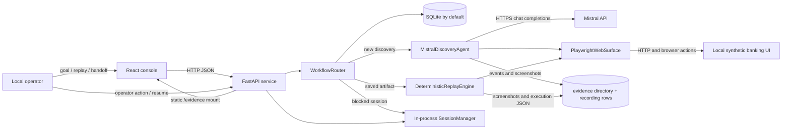
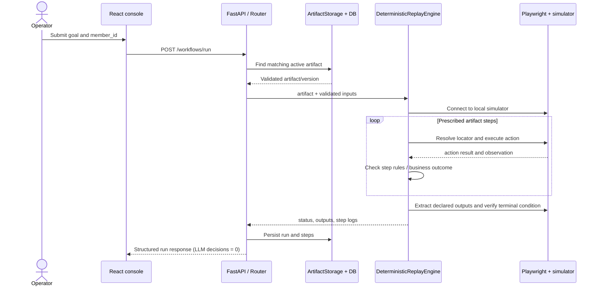
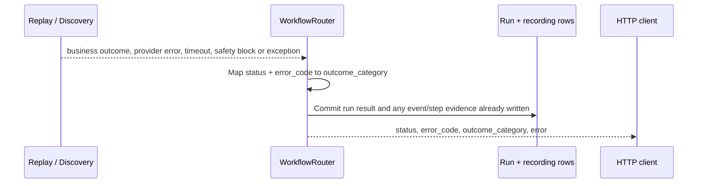
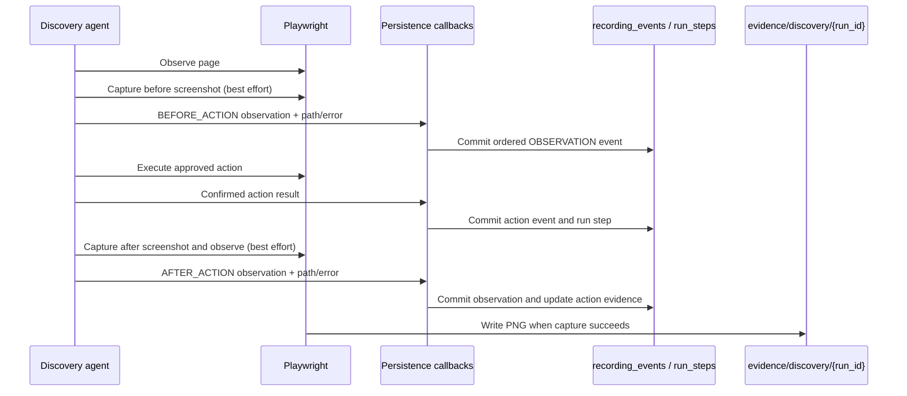

# Architecture

## System context



The deployment is a local multi-process development setup: Vite serves the React UI; FastAPI exposes orchestration APIs and evidence files; the target banking simulator is a separate FastAPI process; Playwright launches a browser to interact with that simulator. SQLite is the default shared database. Mistral is contacted only on discovery decisions.

## Components and source locations

| Component | Responsibility, inputs and outputs | Dependencies and notable failure modes |
|---|---|---|
| Console — `frontend/src/App.tsx`, `components/*`, `services/api.ts` | Displays health, runs, artifacts, recordings, handoffs and evidence; sends JSON requests. | Uses Vite `/api` and `/evidence` proxies. Data refresh is polling, not a push channel. No client auth. |
| API — `backend/app/main.py`, `api/v1/endpoints/*` | Routes workflow and inspection calls, validates request bodies with Pydantic, serves OpenAPI and static evidence. | SQLAlchemy session dependency; app lifespan initializes tables. No authentication middleware. |
| Router — `orchestration/router.py` | Validates target/member input, looks up capability, creates runs, selects replay or discovery, persists lifecycle/result and publishes successful artifacts. | DB transaction/session, artifact storage, Playwright engines, semaphore. Provider, DB, timeout and browser failures become run errors. |
| Discovery agent — `discovery/agent.py`, `prompts.py`, `actions.py` | Observes the page, builds a bounded prompt, requests one typed decision, checks safety, executes supported action and calls persistence callbacks. | `LLMFactory`, Playwright surface, safety policy. Stops on completion, escalation, action/provider failure, model request cap, step cap or outer timeout. |
| Mistral client — `llm/mistral.py` | Sends JSON-mode chat-completion requests, bounds retries/response and validates provider structure and Pydantic response schema. | `httpx`, `MISTRAL_API_KEY`, configured model. Auth and malformed response errors are not retried. |
| Surface adapter — `surfaces/base.py`, `surfaces/playwright.py` | Provides connect, observe, navigate, click, fill, select, extract, screenshot, URL and close operations. | Playwright Python and Chromium. It is a web adapter; desktop abstraction is not implemented. |
| Compiler and schema — `artifacts/compiler.py`, `artifacts/schema.py` | Converts completed executed trace actions into typed replay steps, parameters, outputs, checkpoints and metadata; validates ordered step numbering and references. | Compiler parameter inference is currently specific to member IDs and task keywords. |
| Storage — `artifacts/storage.py` | Stores immutable capability version JSON in relational tables; reads DB first and can fall back to JSON files. Writes mirror atomically after DB commit. | SQLite by default and writable evidence directory. Mirror failure does not roll back DB publication. |
| Replay — `replay/engine.py` | Validates artifact and inputs, launches a fresh surface, executes stored actions, checks known business outcomes/checkpoints, extracts outputs and records screenshot paths. | Playwright and target UI. The normal replay module does not import/use the LLM factory. |
| Safety — `safety/policy.py` | Validates URL scheme/host/path and rejects selected keyword-classified risky actions unless configured otherwise; redacts strings and sensitive dictionary fields. | Heuristic rules. Not authentication, isolation, prompt-injection prevention, or a production sandbox. |
| Handoff manager — `escalation/manager.py` | Holds active `PlaywrightWebSurface` and handoff state in process memory; executes bounded operator action kinds and closes a session. | Backend process lifetime. Sessions cannot be reconstructed from persisted rows after restart. |
| Persistence — `db/models.py`, `db/database.py` | Persists synthetic banking entities, artifacts, runs, steps, recordings, events, handoffs and idempotency records. | SQLite/aiosqlite is the installed/default route. Startup uses `create_all`; no migration runner. |
| Target simulator — `target-app/app.py`, `db/banking.py` | Renders the synthetic member interface and provides member-data API and dialog/delay controls. | Shares `DATABASE_URL` configuration and synthetic DB tables. Data is sample data, not a ledger. |

## Component flow

### Existing capability execution



### Discovery, compilation and validation

```mermaid
sequenceDiagram
    actor Operator
    participant API as Router
    participant DB as SQLite recording/event rows
    participant Agent as MistralDiscoveryAgent
    participant Surface as Playwright simulator
    participant M as Mistral API
    participant Compiler as ArtifactCompiler / Storage
    participant Replay as DeterministicReplayEngine
    API->>DB: Create RUNNING run and RECORDING recording
    API->>Agent: Goal + target URL + persistence callbacks
    Agent->>Surface: Connect and observe DOM
    loop Bounded decision steps
      Agent->>DB: Persist BEFORE_ACTION observation and screenshot path
      Agent->>M: One structured action request
      M-->>Agent: JSON action / classified provider failure
      Agent->>DB: Persist model decision metadata
      Agent->>Agent: Validate schema and safety policy
      opt Approved browser action
        Agent->>Surface: Navigate/click/fill/select/extract
        Surface-->>Agent: Result
        Agent->>DB: Persist actual action, then after-observation evidence
      end
    end
    alt Goal verified
      Agent-->>API: Successful trace and extracted values
      API->>Compiler: Compile executed trace
      Compiler-->>API: Typed artifact
      API->>Replay: Validate in a clean browser context
      alt Replay succeeds
        API->>DB: Atomically commit artifact, run SUCCESS, recording PUBLISHED
      else Replay fails
        API->>DB: Keep failed recording; do not publish artifact
      end
    else Discovery/provider/safety failure
      API->>DB: Persist FAILED/BLOCKED run and recording state
    end
```

### Failure and classification



The mapping in `core/errors.py` returns `SUCCESS`, `BUSINESS_OUTCOME`, `BLOCKED`, `RUNNING`, `RECOVERABLE_ERROR` for a specific allowlist of codes, or `HARD_FAILURE` by default. The status is not the same field as the category.

### Operator handoff and resume

```mermaid
sequenceDiagram
    actor Operator
    participant UI as Human intervention view
    participant API as Handoff routes
    participant Manager as In-process SessionManager
    participant Browser as Preserved Playwright page
    participant DB as Handoff + run rows
    API->>Manager: Keep live surface when run is BLOCKED
    API->>DB: Save AWAITING_HUMAN record and screenshot path
    Operator->>UI: Inspect blocked run
    UI->>API: GET /runs/{id}/handoff
    API->>Manager: Read live-session state
    Manager-->>UI: Session status and action history
    Operator->>UI: Click allowed selector / press key / capture screenshot
    UI->>API: POST /runs/{id}/handoff/action
    API->>Manager: Validate kind and operate same surface
    Manager->>Browser: Execute operator action; capture screenshot
    Operator->>UI: Resume and verify
    UI->>API: POST /runs/{id}/resume
    API->>Browser: Verify member page or member-not-found state
    API->>DB: Set final run status and handoff RESUMED
    API->>Manager: Close session
```

This diagram describes the live-process path. On backend startup, persisted `AWAITING_HUMAN` rows are marked `SESSION_LOST`; a database row cannot restore the browser context.

### Evidence persistence



## Trust boundaries

1. **Operator to API:** request schema validates a goal, target literal, input map, and optional execution mode. There is no authentication or user identity boundary.
2. **Page to model:** interactive DOM data and page text enter a Mistral prompt as untrusted content. The prompt says not to follow page instructions, but this instruction is not a complete prompt-injection defense.
3. **Model to browser:** returned JSON is schema-validated and passed to host/path/action-risk checks before supported actions execute. Those checks are heuristic and do not prove a selector is read-only.
4. **Artifact storage to replay:** Pydantic validates structure/references; artifacts still contain selectors and static expressions that may drift or be unsafe if storage is tampered with. No cryptographic signature is implemented.
5. **Browser/evidence to operator:** screenshots and evidence are served under `/evidence` without authentication. Do not expose the service outside a trusted local environment.
6. **Operator action:** handoff requests are checked for supported action kinds and parameters; an explicit confirmation selector is specially allowed. No authenticated operator role is enforced.

## Architectural invariants and enforcement

| Invariant | Enforcement today |
|---|---|
| Normal replay does not ask an LLM to choose actions. | Replay engine has no LLM client call; integration test installs a forbidden client and passes when browser startup is permitted. |
| Discovery and replay are distinguishable. | Run rows store `execution_mode`; router selects the engine; API reports the mode. |
| Only validated, ordered artifacts can publish. | Pydantic publication validator requires non-empty contiguous numbered steps and valid references; router performs a clean-context replay before saving. |
| Policy checks precede model-proposed browser actions. | Discovery calls `validate_action` before executing the action; replay checks each step before its action. Heuristic policy has limitations described in [Safety](safety-and-security.md). |
| Evidence is linked to runs. | Recordings have a unique run FK, recording events carry recording ID/sequence, replay steps carry run ID and screenshot path. Files themselves are not cryptographically bound. |
| Sensitive data is not stored in any evidence. | **Requirement, not a guarantee.** Sanitizers redact common patterns and sensitive dictionary keys, but page text goes to the external model and screenshots can contain data; coverage is not complete. |

## Data and execution model

SQLAlchemy models persist `runs`, `run_steps`, `discovery_recordings`, `recording_events`, `handoff_records`, `capabilities`, `capability_versions`, `workflow_idempotency`, and synthetic banking entities. `EvidenceModel` exists in the schema but current route/engine paths use path fields and JSON event data instead. The active database is selected by `DATABASE_URL`, defaulting to `sqlite+aiosqlite:///./orchestration.db`.

Evidence images, discovery trace JSON and artifact JSON mirrors are filesystem outputs under `EVIDENCE_DIR`; DB rows remain the source used by listing APIs. `create_all` adds missing tables but does not alter existing columns. The SQL file under `backend/migrations` has no built-in migration command.

## Runtime topology and limitations

- Vite defaults to `127.0.0.1:3000` and proxies API/evidence to `http://localhost:8000`; `VITE_API_PROXY_TARGET` overrides the proxy.
- The backend defaults to `127.0.0.1:8000`; the target simulator binds `127.0.0.1:3001` in its script entry point.
- `MAX_CONCURRENT_RUNS` defaults to 2, enforced by an in-process semaphore. It is not a distributed queue or cross-process concurrency lock.
- Docker Compose is not runnable from this repository as checked out: Dockerfiles are absent and its PostgreSQL driver dependency is undeclared.
- No native desktop surface, durable session store, API auth, tenant isolation, or production deployment is present.

Related detail: [workflow lifecycle](workflow-lifecycle.md), [discovery](discovery-and-recording.md), [artifacts](capability-artifacts.md), [replay](deterministic-replay.md), [safety](safety-and-security.md).
