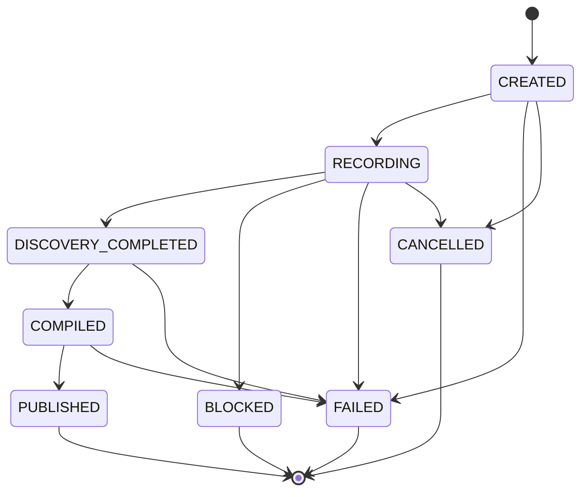

# Workflow lifecycle

## Routing paths

`POST /api/v1/workflows/run` validates the Pydantic request, then `WorkflowRouter` requires the APEX Federal target and a 4–5 digit member ID in either `input_parameters.member_id` or a matching phrase in the goal. It looks up a capability by current keyword rules:

- Goals containing “savings” and “balance” may match `member_savings_lookup`.
- Otherwise a goal containing “profile” may match `member_profile_lookup`.
- Other goals enter discovery unless the caller forces replay; forced replay without a matching compatible artifact fails.

`force_mode=DISCOVERY` bypasses artifact reuse. `force_mode=REPLAY` requires a match. When mode is omitted, the router reuses a match if it finds one; otherwise it selects discovery.

The server limits concurrent workflow submissions with an in-process semaphore (`MAX_CONCURRENT_RUNS`, default 2). A single discovery run is bounded by a duration timeout and by agent step/model-decision caps. These controls are process-local.

## Run statuses and outcome categories

Run status is stored separately from the category returned by `execution_outcome_category`.

| Run status | Category | Meaning |
|---|---|---|
| `RUNNING` | `RUNNING` | Run row claimed and work in progress. |
| `SUCCESS` | `SUCCESS` | Replay completed and final condition passed. A discovery run only reaches this after its compiled artifact passes clean-context replay. |
| `BUSINESS_OUTCOME` | `BUSINESS_OUTCOME` | Expected domain state such as member not found or savings-account ambiguity. |
| `BLOCKED` / `AWAITING_HUMAN` | `BLOCKED` | A confirmation dialog or explicit escalation requires an operator. |
| `FAILED` with allowlisted transient code | `RECOVERABLE_ERROR` | The mapping considers the code recoverable; it does not automatically retry the whole workflow. |
| Other `FAILED` | `HARD_FAILURE` | Failed validation, policy or execution with no recognized recoverable mapping. |
| `CANCELLED` | `HARD_FAILURE` currently | Cancellation is persisted with `RUN_CANCELLED`; that code is not in the recoverable allowlist. |

See [Error handling](error-handling.md) for codes and retry semantics.

## Discovery recording states

The router enforces these transitions:

The usual successful path is `CREATED → RECORDING → DISCOVERY_COMPLETED → COMPILED → PUBLISHED`. Blocked, failed and cancelled are terminal in the transition map. A replay-only run has no discovery recording.

## Persistence points

1. The router claims a `RUNNING` run. When supplied, the idempotency row is inserted in that claim transaction.
2. Discovery creates a recording, transitions it to `RECORDING`, and commits it before browser work begins.
3. Event callbacks persist observations, model-decision metadata, action results and run steps incrementally. A provider/browser failure therefore may leave a partial trace.
4. Successful discovery creates and validates an artifact, then replays it in a clean context.
5. The final success transaction commits the DB artifact version, run status and recording publication state. The filesystem JSON mirror is written after this DB commit.

Recording event sequence numbers are assigned in the router callback and unique per recording. Current callbacks commit individually. Screenshots are written as files and a missing screenshot does not prevent the event row from being stored.

## Idempotency

Both workflow run and explicit replay accept an optional `Idempotency-Key` header. Valid keys have 8–255 printable ASCII characters. The service stores a SHA-256 hash of the key and a SHA-256 fingerprint of goal, target, bound inputs, mode and capability ID. Reuse with the same fingerprint returns the associated run; different content returns HTTP 409 `IDEMPOTENCY_KEY_CONFLICT`. Raw keys are not stored. Idempotency records are not currently expired or pruned.

The frontend sends a fresh UUID per submit. This makes a repeated HTTP request using that same header idempotent, but the UI does not itself implement a retry loop that preserves a key across a new submit.

## Cancellation and timeout

Discovery runs execute under `asyncio.timeout(MAX_DISCOVERY_DURATION_SECONDS)`, default 180 seconds. Cancellation handlers mark the run and recording `CANCELLED`, commit under `asyncio.shield`, close the browser and re-raise cancellation. A generic failure is mapped to a permission error, discovery timeout or generic discovery error. Browser/DB failures during the cancellation commit itself are not separately tested.

## What is not a lifecycle guarantee

- `RECOVERABLE_ERROR` is a classification, not a scheduler action or automatic retry.
- A run record does not imply a complete recording; replay has run steps but no discovery recording, and early startup failure can have no step screenshot.
- A `PUBLISHED` artifact means the implementation's schema and configured replay checks passed once; it does not prove compatibility with future UI versions or business correctness for every parameter.
- The router's capability lookup is currently narrow keyword matching rather than a semantic planner.

Next: [discovery and recording](discovery-and-recording.md), [artifact publication](capability-artifacts.md), [replay](deterministic-replay.md).
